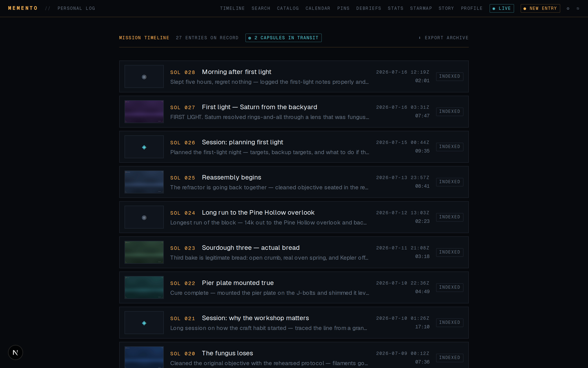
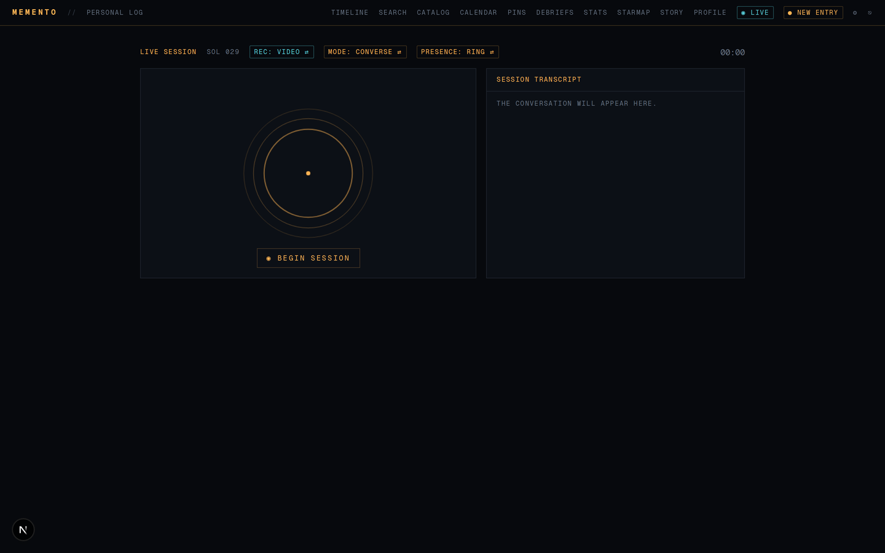
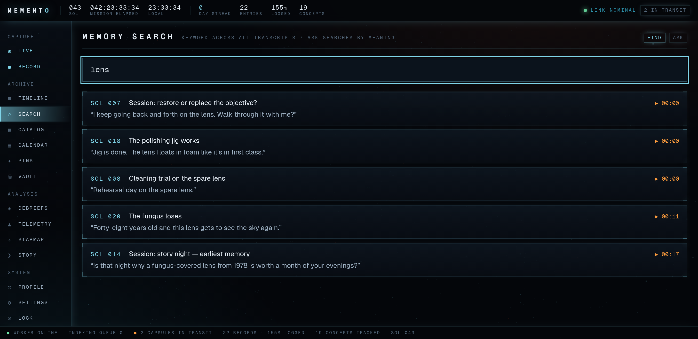
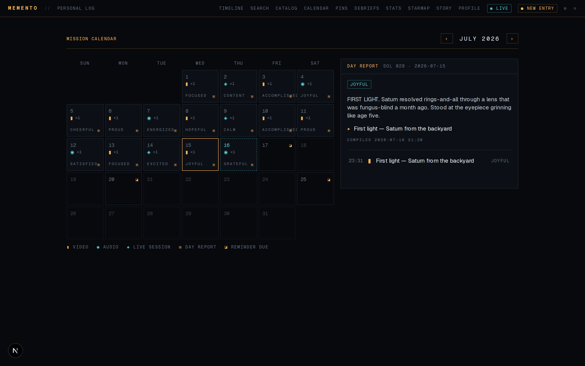
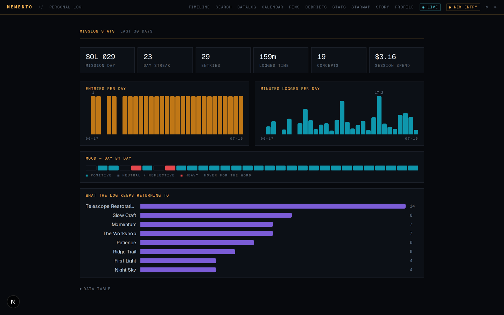
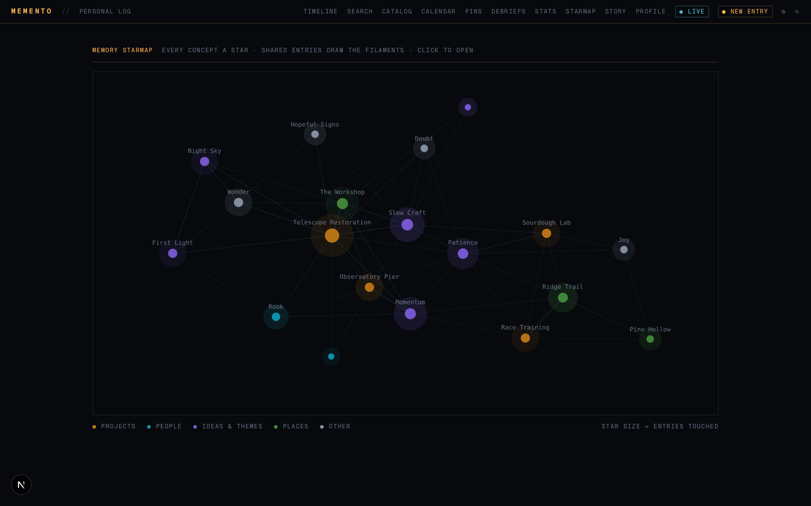
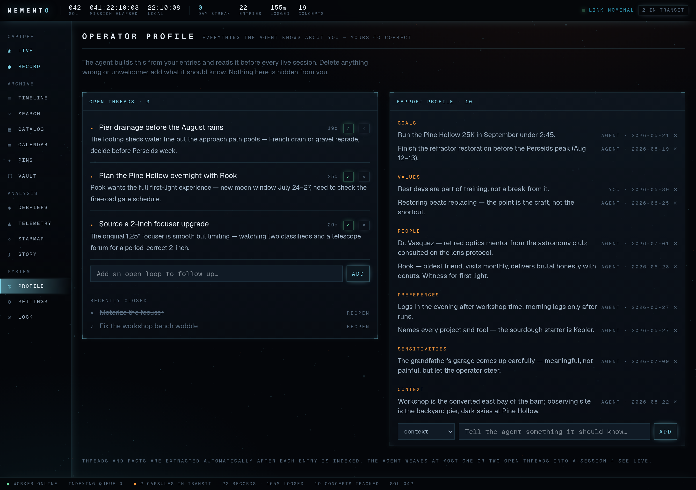
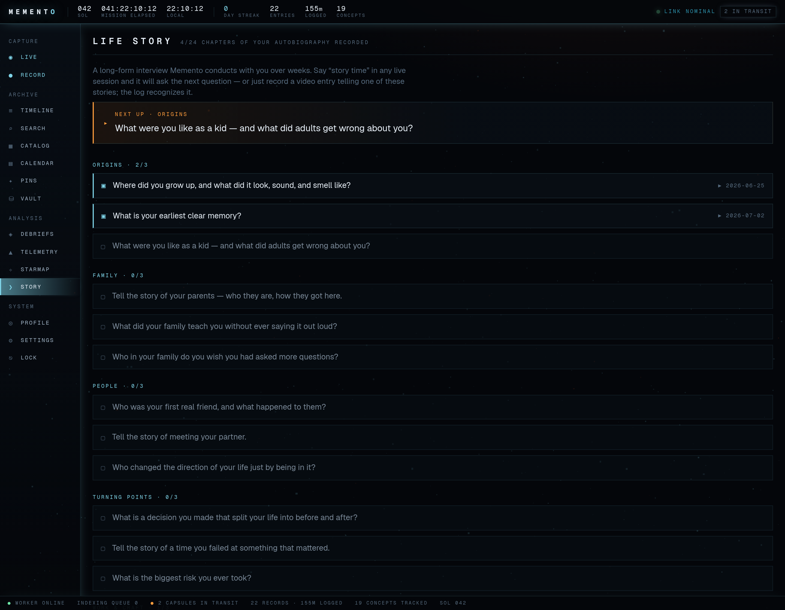
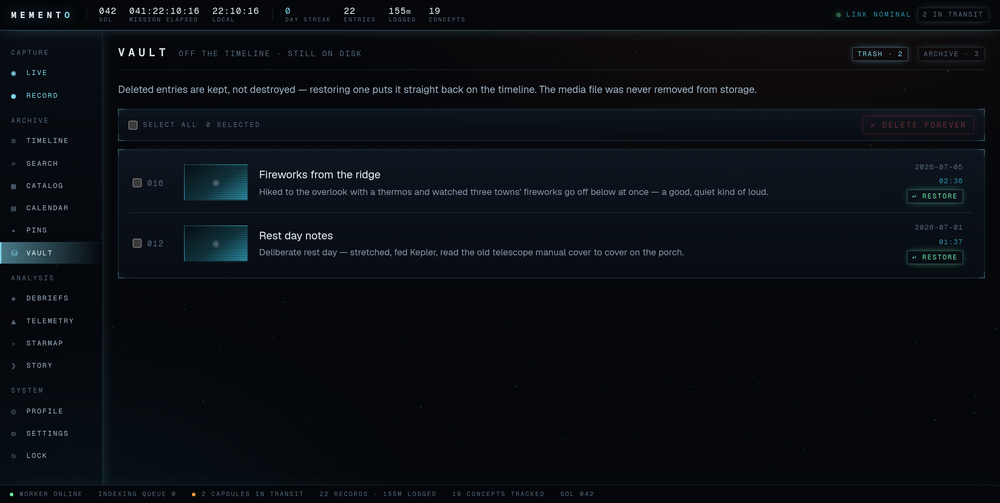

# MEMENTO

**A private journal you talk to.** Record a video or voice log — or hold a
full-duplex conversation with an agent that has read everything you've ever
logged. Every entry is transcribed, embedded, summarized, and cross-linked, so
the archive answers questions instead of just storing them.

Runs entirely on your own hardware. Transcription, embeddings, concept
extraction, reflection, vision, and day/week reports are all local models; the
only optional cloud call is the realtime voice session.


Vision and rationale live in [PLAN.md](PLAN.md). This file is the operational
reference.

---

## Contents

- [Screenshots](#screenshots)
- [What it does](#what-it-does)
- [Architecture](#architecture)
- [How an entry flows](#how-an-entry-flows)
- [Quickstart](#quickstart)
- [Configuration](#configuration)
- [Operating it](#operating-it)
- [Security](#security)
- [Feature reference](#feature-reference)
- [Known limits](#known-limits)
- [Roadmap](#roadmap)
- [License](#license)

---

## Screenshots

Every shot below comes from a demo instance seeded with **fictional** data
(`memento_demo` — a telescope restoration, a trail-race training block, and a
sourdough starter named Kepler). Nothing here is a real journal.

**Mission timeline** — the home feed. Every log indexed, transcribed, and
summarized, with the archive orbit, system health, and open threads alongside.



**Live console** — full-duplex voice sessions with the agent. Recording mode,
conversation mode, and presence surface are all switchable before you start.



**Memory search** — every moment that actually used the word, ranked, each one
deep-linking to the exact second it was said.



**Mission calendar** — activity pips, day mood, reminders due, and an
LLM-compiled report behind every day.



**Telemetry** — streaks, logged time, session spend, a mood valence strip, and
what the log keeps returning to.



**Memory starmap** — every concept a star, sized by how many entries touch it;
shared entries draw the filaments between them.



**Operator profile** — everything the agent believes about you: open threads it
follows up across sessions, and the rapport model. All of it editable, none of
it hidden.



**Life Story** — a long-form autobiography interview conducted a few questions
at a time, over weeks.



**Vault** — trash and archive. Deleting takes an entry off the timeline without
destroying it; purging is explicit, separate, and irreversible by design.



---

## What it does

**Capture**
- Video and audio log entries from the browser, or import existing media files.
- Full-duplex voice sessions with an agent briefed on your recent history.
- Time capsules — seal an entry until a future delivery date.

**Understand**
- Word-level transcription with click-to-seek synced transcripts.
- Concept extraction (people, places, projects, ideas, themes) into a catalog.
- A vision pass that describes what each video actually looked like.
- Reflection after every entry: opens and resolves threads, updates your profile.

**Retrieve**
- Literal keyword search over every transcript, deep-linked to the second.
- **Ask** — semantic retrieval over the whole log, answered in your journal's
  own words, with citations that deep-link to the exact video second.
- Concept catalog, mission calendar with day reports, weekly debriefs.

**Remember for you**
- Pins: reminders and notes captured from natural speech.
- Threads: unresolved loops the agent carries between sessions.
- Rapport profile: goals, values, people, preferences, sensitivities, context.
- Life Story: 24 topics across 9 chapters, checked off as you tell them.

**Report**
- Day reports, weekly debriefs with narrated recap videos, morning briefings,
  and an evening nudge that only fires when you haven't logged.

---

## Architecture

| Component | What it is |
| --- | --- |
| `web/` | Next.js 16 app — Mission Log console UI and all API routes. Port **8742** |
| `worker/worker.py` | Python pipeline polling Postgres: transcription, embeddings, LLM extraction, reflection, vision, day/week reports, capsule delivery, recap videos |
| `db/schema.sql` | Postgres 17 + pgvector schema. Port **5433** |
| MinIO | S3-compatible store for raw media. API **9400**, console **9401** |
| ntfy | Self-hosted push for briefings and nudges. Port **8744** |
| `scripts/` | Backups, migrations, dev bootstrap, briefing, nudge, avatar render |
| `.env` | Single shared config; the web app reads it via the `web/.env.local` symlink |

The console UI is composed of a few dedicated surfaces: a persistent module
rail (`ModuleRail`), mission-elapsed clock (`MissionClock`), parallax starfield
backdrop (`VoidField`), archive orbit visual (`ArchiveOrbit`), and the live
avatar surface (`AvatarLive`). Version and author metadata come from
`web/src/lib/version.ts`.

Models are pluggable via `.env`: `WHISPER_MODEL` for transcription,
`OLLAMA_MODEL` for text, `VISION_MODEL` for the vision pass.

> **Note on Next.js:** this project tracks a Next.js version with breaking
> changes from earlier releases. See `web/AGENTS.md` before writing app code.

---

## How an entry flows

```
record console (or Import Media File)
  → POST /api/entries
  → PUT  /api/entries/:id/media        (streamed to MinIO)
  → status: uploaded
  → worker claims it (FOR UPDATE SKIP LOCKED)
  → ffmpeg → 16k mono
  → faster-whisper (word timestamps, VAD) → segments rows
  → thumbnail frame → MinIO             (video entries)
  → title / summary / mood via local Ollama
  → status: indexed
```

If Ollama is down the entry still lands, falling back to a first-words title.
The entry page polls until indexed, then renders the synced transcript.

Everything downstream of the media is **derived data**. To regenerate an entry
completely — transcript, metadata, vision, reflection — reset it:

```sql
UPDATE entries SET status='uploaded' WHERE id='…';
```

Deletes are soft (`deleted_at`) and archiving is separate (`archived_at`); raw
media is never touched by either. See [Vault](#vault) for the one destructive
path.

---

## Quickstart

**Development:**

```bash
systemctl --user stop memento-web      # free port 8742 if it's running
bash scripts/dev.sh                    # docker + migrate + worker + next dev
```

Open <http://localhost:8742>. Camera capture requires localhost or HTTPS — over
Tailscale, use `tailscale serve` for HTTPS or browse from the host itself.

The first worker run downloads the whisper model (`WHISPER_MODEL`, default
`small`; `medium` for accuracy, `base` for speed).

**First run** claims the terminal at `/register`. That route closes
permanently once an operator exists.

**Install on your phone (PWA):** open the Tailscale HTTPS URL, then Android
Chrome: ⋮ → *Install app*; iOS Safari: Share → *Add to Home Screen*. Launches
standalone with a notch-safe layout.

---

## Configuration

All configuration is one `.env` at the repo root (`.env.example` is the
template). Highlights:

| Variable | Purpose |
| --- | --- |
| `DATABASE_URL` | Postgres connection string |
| `AUTH_SECRET` | HMAC key for session cookies |
| `WHISPER_MODEL` / `WHISPER_DEVICE` / `WHISPER_COMPUTE` | Transcription model and placement |
| `OLLAMA_URL` / `OLLAMA_MODEL` | Local text model (default `qwen2.5:7b`) |
| `VISION_MODEL` | Local VLM for the visual log (qwen2.5-VL) |
| `EMBED_MODEL` | Embedding model for search (default `nomic-embed-text`) |
| `SEARCH_SEMANTIC_MAX_DIST` | Cosine-distance ceiling on semantic neighbours used by Ask and the agent tool (default `0.33`) |
| `OPENAI_API_KEY` | Optional — enables live voice sessions and TTS narration |
| `OPENAI_REALTIME_MODEL` / `REALTIME_VOICE` | Defaults `gpt-realtime` / `marin` |
| `TTS_VOICE` | Overrides the recap narrator voice |
| `RATE_AUDIO_IN` / `RATE_AUDIO_OUT` / `RATE_TEXT_IN` / `RATE_TEXT_OUT` | Per-token rates for the cost meter |
| `S3_*` | MinIO endpoint, credentials, bucket |
| `NTFY_URL` / `NTFY_TOPIC` / `NTFY_BIND_IP` | Push notifications |
| `AVATARFORCING_DIR` / `NARRATOR_REF` / `AVATAR_MAX_S` | Avatar renderer install, face image, clip cap |
| `BACKUP_KEY` / `OFFSITE_CMD` | Backup encryption key and offsite sync command |

Without an `OPENAI_API_KEY` the live page explains itself and everything else
keeps working.

---

## Operating it

The reference deployment is fully persistent: Docker services restart
themselves, and the web app and worker run as systemd **user** services with
lingering enabled, so they survive reboots and crashes.

```bash
systemctl --user status memento-web memento-worker
journalctl --user -u memento-worker -f                 # follow worker logs

# after changing web code
(cd web && npm run build) && systemctl --user restart memento-web

# after changing worker code
systemctl --user restart memento-worker
```

**Backups** — `scripts/backup.sh` runs nightly at 03:10 via cron: `pg_dump`
with 14-day retention, an additive media mirror to `~/memento-backups/`
(`MEMENTO_BACKUP_DIR` to override), and an AES-256 encrypted copy staged in
`~/memento-backups/offsite/`.

```bash
# decrypt a staged bundle
openssl enc -d -aes-256-cbc -pbkdf2 -pass "pass:$BACKUP_KEY" -in x.enc -out x.dump
```

Keep a copy of `BACKUP_KEY` somewhere that is **not** this machine. Set
`OFFSITE_CMD` to an rclone/rsync line to actually ship the bundles; until then
the nightly log warns.

---

## Security

- **Auth** — passphrase login (scrypt hash in the users row; a legacy `.env`
  `AUTH_HASH` is a fallback that auto-migrates on login) issues an HMAC-signed
  HttpOnly cookie, 30-day TTL. `web/src/proxy.ts` guards every route and API.
  Login is rate-limited to 5/min/IP with constant-time verification.
- **Settings** (⚙ in the rail) — change passphrase, operator name, accent theme
  (Terminal Amber / Cryo Cyan / Botanic / Nebula, applied app-wide from
  `users.settings.theme`), toggle the vision pass, and configure the voice
  agent. An OpenAI key set here is stored in the local DB and never reaches the
  browser; blank falls back to `.env`. Lock the terminal with ⎋.
- **Ports** — Postgres and MinIO bind to `127.0.0.1` only; ntfy binds to
  localhost plus the Tailscale IP. Only the web app on 8742 is reachable.
- **Passphrase recovery** — from the host shell:

  ```bash
  docker compose exec -T db psql -U memento -d memento \
    -c "UPDATE users SET settings = settings - 'auth_hash';"
  ```

  Then remove `AUTH_HASH` from `.env`, restart `memento-web`, and re-claim the
  terminal at `/register`.

---

## Feature reference

### Search, Ask, and the catalog

- **/search** — literal, and deliberately so. Results are segments that
  actually contain your terms (Postgres FTS, ranked by `ts_rank`), each
  deep-linking to the exact second (`/entry/:id?t=`). If the log never said the
  word, you get nothing rather than a plausible-looking stranger.

  Searching used to fuse semantic guesses into this list by reciprocal rank,
  which let a top-ranked guess outscore a real word match — and because a
  nearest-neighbour query returns its full limit however far away the rows are,
  a word the journal had never heard still produced a screenful of results.
  Meaning-based lookup now lives in **Ask**, where an LLM has to justify each
  citation, rather than in a list that looks authoritative.
- **Ask** — still semantic: the question goes through hybrid retrieval
  (nomic-embed-text via Ollama, pgvector HNSW cosine, bounded by
  `SEARCH_SEMANTIC_MAX_DIST`) plus the literal matches, and the local LLM
  answers in your journal's own words with `[n]` citations that jump to the
  moment they came from.
- **Find ⇄ Ask** — Ask runs the question through the same retrieval plus the
  local LLM and answers in your journal's own words, citing `[n]` sources that
  each jump to the moment they came from. Fully local, no API cost.
- **/catalog** — concepts extracted per entry by the LLM; every concept has a
  page listing the entries that touch it.

### Live agent

`/live` is a full-duplex voice session (OpenAI Realtime over WebRTC; the
browser connects directly and the server only mints ephemeral session tokens
and serves the `search_journal` tool).

Each session gets a generated brief: a question ladder (L0 check-in through L3
depth, escalating only on engagement), recent entry summaries, recurring
concepts, a no-fabrication rule — it must call `search_journal` before
referencing your past — and companion-not-therapist guardrails. Ended sessions
are saved as `live_session` entries and indexed like any other.

Sessions are **recorded by default** (`rec: video ⇄` cycles video/audio/off
before starting): your camera and mic mixed with the agent's voice, uploaded on
session end. Recording and transcript share the session clock, so transcript
lines seek the video. The worker never re-transcribes session recordings — the
Realtime transcript already has correct you-vs-agent attribution — it only adds
the thumbnail and true duration.

A live **cost meter** shows an `≈$` estimate in the session header while you
talk, saved to the entry's `cost_usd`. It is deliberately absent from entry
pages: spend surfaces only in aggregate, on the Telemetry session-spend tile
and in each weekly debrief header.

### Presence and the avatar

The `presence: ring ⇄ avatar` chip on `/live` switches the presence surface:

- **ring** — audio-reactive: amber when Memento speaks, cyan when you do.
- **avatar** — the AvatarForcing face (`assets/narrator.jpg`, the same face as
  the recap narrator) in **delayed replay**. Each finished reply's audio is
  rendered to a clip and played muted, since the real audio already played
  live. On a GB10 this runs at roughly 5× realtime, so clips trail speech by
  about 15–20s: a taste test, not lip-sync. The panel shows the narrator still
  and a RENDERING chip while clips cook.

Rendering prefers a warm daemon on port **8745** that keeps models loaded
(`memento-avatar.service`). That service is **optional and off by default** —
when it isn't listening, `/api/avatar/render` falls back to a cold subprocess
run of `scripts/render_avatar.py`, which is slower but needs nothing resident.
Set `AVATARFORCING_DIR` to enable either path; without it the route reports
"not configured" and the ring presence still works. An earlier 3D-head surface
remains, unused, in `AvatarHead.tsx`.

### Listen Mode

`mode: converse ⇄ listen` on `/live`. In Listen Mode Memento is a silent
companion: it transcribes everything and the session still becomes an entry,
but it speaks only when addressed by name — "Memento, …". Wake-word detection
is client-side on the live transcript, and VAD runs with auto-response
disabled, so silent listening costs almost nothing in output tokens.

### Pins — reminders and notes

Say "remind me…", "pin that", or "note that down" in any entry or live session
and it lands on **/pins**, split into overdue / upcoming / notes / recently
closed. Dates are resolved **deterministically in code** from your phrase
("Monday", "tomorrow", "this weekend") — not by the LLM. Due reminders appear
on the calendar (◪, red when overdue) and in that day's report. The live agent
is briefed on what's due today and tomorrow, and has a `create_pin` tool to
pin things mid-conversation.

### Time capsules

In the recorder's review step, **◍ Seal as Time Capsule** hides an entry until
a delivery date — a message to future you. Sealed entries are invisible
everywhere (timeline, search, calendar, export, media API) and aren't even
transcribed until delivery day, when the worker unseals them into the normal
pipeline and the morning briefing announces "a message from your past."

### Vault

**/vault** is where entries go when they leave the timeline, in two tabs:

- **Trash** — soft-deleted (`deleted_at`). Restoring puts an entry straight
  back on the timeline; the media file was never removed from storage.
- **Archive** — set aside deliberately (`archived_at`). Archived entries stay
  in the log and stay searchable; they just don't crowd the timeline.

Purging is the **only destructive path in the app**, and it is deliberately
narrow: only rows already in the trash can be purged, so nothing on the
timeline or in the archive can be destroyed by a stray request. It is scoped to
the operator, requires explicit multi-select plus confirmation, and removes the
media objects after the row. A storage failure is logged rather than failing
the request — a stray object is recoverable, a half-deleted row is not.

### Flags and export

Hover any transcript line and hit **⚑** to flag a moment, stored as a `user`
annotation. The indexing LLM also proposes `action_item` and `insight` flags
from the transcript, collected in each entry's "Flagged Moments" panel (✕ to
dismiss).

**⬇ Export Archive** on the timeline streams a zip containing
`memento-export.json` with full metadata, plus per-entry transcripts and
original media.

### Threads and the rapport profile

**/profile** is the agent's model of you, fully visible and editable:

- **Open threads** — unresolved loops it follows up across sessions. Resolve ✓,
  drop ✕, or add your own.
- **Rapport profile** — goals, values, people, preferences, sensitivities,
  context. Delete anything, add anything.

After every indexed entry the worker runs a **reflection pass**: it opens new
threads, resolves the ones the entry settles, and adds genuinely new profile
facts. Live sessions read open threads and profile in their instructions and
weave in at most one or two, naturally.

### Life Story program

**/story** — a seeded interview program of 24 topics across 9 chapters. Say
"story time" in a live session and the agent offers the next topic; or just
record an entry telling one of the stories. The reflection pass recognizes
substantial tellings, checks the topic off, and links it to the entry.

### Visual log

The indexing pass shows three frames of each video entry to a local VLM
(`VISION_MODEL`, qwen2.5-VL) and records scene, appearance, and energy. It
appears as the "Visual Log" line on entries and feeds the day reports.
Toggle it in ⚙ Settings; it runs entirely on local hardware.

### Mission calendar and day reports

**/calendar** — a month grid with activity pips per day (▮ video · ◉ audio ·
◈ live session), day mood, and a ▣ marker once the report exists. Clicking a
day opens it: an LLM-compiled narrative, highlights, day mood, and that day's
entries.

Reports compile **after the day ends** (the worker checks every ~5 minutes, so
completed days appear shortly after midnight). If a past day's entries later
change, its report recompiles — or is removed if the day empties. Postgres runs
on `America/New_York` so days group by local time.

### Morning briefing and weekly debriefs

- **Briefing** — cron 08:00 runs `scripts/briefing.py`: SOL, due and overdue
  reminders, open threads, yesterday's report, and the logging streak, pushed
  through the self-hosted ntfy container.
- **Evening nudge** — cron 21:00 runs `scripts/nudge.py`, and fires **only** if
  nothing was logged that day: a streak warning plus one hook (an open thread,
  the next story topic, or tomorrow's reminder). Silent on logged days. No LLM
  anywhere in the wake-up path.
- Subscribe on your phone: ntfy app → add server `http://<tailscale-ip>:8744` →
  topic `NTFY_TOPIC`.
- **/debriefs** — MISSION WEEK reports compiled once a week completes
  (Mon–Sun): the week's story, highlights, a patterns observation, and week
  mood. Recompiles if a past week's entries change.
- Each debrief also gets a **recap video**: an intro title card, then an
  AvatarForcing narrator speaking the week's summary, then the week's flagged
  clips. The narrator speaks with the agent's configured voice (Settings →
  Voice Agent, or `TTS_VOICE`) via OpenAI TTS. Every failure degrades
  gracefully: no face → voiceover only; no key → silent clips only. Plays
  inline on /debriefs.

### Telemetry and starmap

- **/stats** — stat tiles (SOL, streak, entries, minutes, concepts, spend),
  30-day entries and minutes bars with hover tooltips, a mood valence strip
  (positive / neutral / heavy, hover for the word), top concepts, and a plain
  data table. Chart mark colors are CVD-validated against the dark surface
  (`src/lib/mood.ts` `CHART`) and deliberately distinct from the lighter UI
  accent tints.
- **/starmap** — the memory constellation: concepts as glowing stars (size =
  entries touched, color = kind), co-occurrence filaments, hover to light a
  star's connections, click to open its catalog page. The layout settles
  synchronously on a cooling schedule — no live physics, so it cannot explode.

---

## Known limits

- Whisper runs on CPU: the aarch64 ctranslate2 wheel has no CUDA build. This is
  fine for daily entries; whisper.cpp with CUDA is the option if it starts to
  hurt.
- The live avatar is delayed replay, not realtime lip-sync — see
  [Presence and the avatar](#presence-and-the-avatar).
- Semantic search and Ask need Ollama reachable for query embedding; both
  degrade to keyword-only when it isn't.

## Roadmap

- Offsite backup destination (`OFFSITE_CMD` — encrypted bundles stage locally
  meanwhile).
- Voice-only quick capture (push-to-talk memo).
- Native mobile app (Expo), when the PWA's limits start to chafe.
- The photoreal face, waiting on Wan-Streamer-class open weights; the renderer
  boundary is already in place.

---

## License

Licensed under the [PolyForm Noncommercial License 1.0.0](LICENSE).

You may use, modify, and share Memento for any **noncommercial** purpose —
personal use, hobby projects, study, research, and use by charitable,
educational, public research, public safety, health, environmental, and
government organizations. **Commercial use is not granted.**

This is a source-available license, not an OSI-approved open source one: the
noncommercial restriction is deliberate.

Interested in a commercial license? Open an issue or reach out to
[@xD4O](https://github.com/xD4O) — happy to talk.

The license covers the code in this repository. Dependencies keep their own
licenses (all permissive: MIT, Apache-2.0, BSD-2-Clause), and ffmpeg, Ollama,
and the model weights are separate programs under their own terms.
